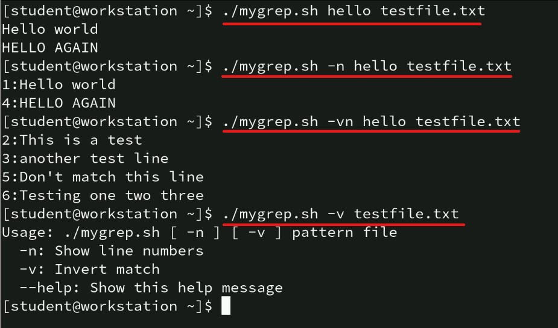

# 📚 MyGrep: Mini Bash Version of `grep`

---

## 🔍 Key Points

- A Bash script named `mygrep.sh` mimics basic `grep` functionality.
- Supports **case-insensitive** string searches and prints matching lines from a text file.
- Handles command-line options:
  - `-n` (show line numbers)
  - `-v` (invert match)
  - Combination of options (e.g., `-vn`, `-nv`) works seamlessly.
- Error handling for invalid inputs, missing files, or insufficient arguments.
- Includes a `--help` flag for usage information.
- Uses `getopts` for robust option parsing.

---

## 🖊️ Script Overview

The `mygrep.sh` script:
- Searches a file for a given string (case-insensitive).
- Prints lines matching or not matching the string (based on `-v`).
- Optionally prefixes each output line with its line number (`-n`).
- Mimics the basic output style of `grep`.

---

## 🔢 Expected Behavior

Given `testfile.txt`:
```
Hello world
This is a test
another test line
HELLO AGAIN
Don't match this line
Testing one two three
```

| Command                               | Expected Output |
|---------------------------------------|-----------------|
| `./mygrep.sh hello testfile.txt`       | Hello world<br>HELLO AGAIN |
| `./mygrep.sh -n hello testfile.txt`    | 1:Hello world<br>4:HELLO AGAIN |
| `./mygrep.sh -vn hello testfile.txt`   | 2:This is a test<br>3:another test line<br>5:Don't match this line<br>6:Testing one two three |
| `./mygrep.sh -v testfile.txt`          | Usage message |



---

## 🔧 mygrep.sh
```bash
#!/bin/bash

# Initialize variables for options
show_numbers=false
invert_match=false

# Function to print usage information
print_usage() {
  echo "Usage: $0 [ -n ] [ -v ] pattern file"
  echo "  -n: Show line numbers"
  echo "  -v: Invert match"
  echo "  --help: Show this help message"
}

# Check for --help option
for arg in "$@"; do
  if [ "$arg" == "--help" ]; then
    print_usage
    exit 0
  fi
done

# Parse options using getopts
while getopts "nv" opt; do
  case $opt in
    n) show_numbers=true ;;
    v) invert_match=true ;;
    \?) echo "Invalid option: -$OPTARG" ; print_usage ; exit 1 ;;
  esac
done
shift $((OPTIND -1))

# Check if pattern and file are provided
if [ $# -lt 2 ]; then
  print_usage
  exit 1
fi

pattern=$1
file=$2

# Check if the file exists
if [ ! -f "$file" ]; then
  echo "File not found: $file"
  exit 1
fi

# Convert pattern to lowercase for case-insensitive search
pattern_lower=$(echo "$pattern" | tr '[:upper:]' '[:lower:]')

# Initialize line number counter
line_num=0

# Read the file line by line and perform the search
while read -r line; do
  line_num=$((line_num + 1))
  line_lower=$(echo "$line" | tr '[:upper:]' '[:lower:]')
  
  # Check if the line matches the pattern (case-insensitive)
  if [[ $line_lower == *$pattern_lower* ]]; then
    match=true
  else
    match=false
  fi
  
  # Decide whether to print the line based on options
  if [ $invert_match == true ]; then
    if [ $match == false ]; then
      if [ $show_numbers == true ]; then
        echo "$line_num:$line"
      else
        echo "$line"
      fi
    fi
  else
    if [ $match == true ]; then
      if [ $show_numbers == true ]; then
        echo "$line_num:$line"
      else
        echo "$line"
      fi
    fi
  fi
done < "$file"
```

---

## 📈 Implementation Details

### 🧬 Script Functionality
- **Case-insensitive** search is done by converting strings to lowercase.
- Options parsing is handled by `getopts`.
- Supports `--help` for usage.
- Error handling for missing arguments, invalid options, and missing files.

### 💡 How It Works
- Parses options (`-n`, `-v`) first.
- Shifts arguments to extract pattern and filename.
- Reads file line-by-line, performing case-insensitive search.
- Inverts match if `-v` is set.
- Displays line numbers if `-n` is set.

---

## 🔄 Bonus Features
- **--help flag** support.
- **Combination of options** like `-nv` and `-vn`.
- **Robust error handling** for common user mistakes.


## 🔹 Testing Instructions

1. Save script as `mygrep.sh`.
2. Make it executable:
   ```bash
   chmod +x mygrep.sh
   ```
3. Create `testfile.txt` with provided content.
4. Run test commands and validate output.


---

## 🤔 Reflective Section

### 🔍 Argument and Option Handling
- Used `getopts` for clean and modular parsing.
- Manually handled `--help` for better user experience.

### 📗 Supporting Regex and More Options
- To add regex support: use `[[ $line =~ $pattern ]]` instead of `==`.
- Can enhance to support `-c` (count matches) or `-l` (list matching files).

### 🎯 Hardest Part
- Balancing simplicity and robustness.
- Managing option parsing and argument validation reliably.

### 📊 Limitations
- No support for regular expressions (simple substring match).
- ASCII-only case-insensitivity.
- Bash's speed limitations on very large files.


---

## 🎉 Conclusion
The `mygrep.sh` script successfully replicates a mini version of `grep`, supporting case-insensitive search, line number display, inverted match, and robust error handling.

Further improvements could add regular expression matching and more options! 🚀

---

> Happy Scripting! ✨

