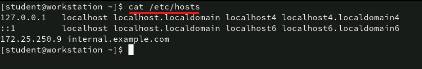
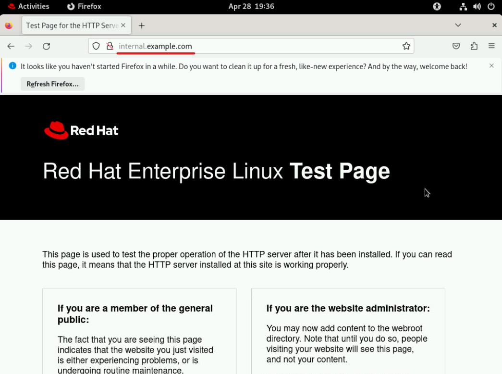

# 🌐 Troubleshooting Internal Domain Resolution: `internal.example.com`

---

## 📋 Key Points
- Issue likely caused by **DNS resolution failure**.
- Systems may not be using the **internal DNS server** or the DNS server might be down.
- Fixes include **updating `/etc/resolv.conf`**, verifying DNS, and checking **network connectivity**.

---

## 🧠 Quick Summary
- **Verify DNS:** Ensure internal.example.com resolves properly.
- **Diagnose Reachability:** Check network and service status.
- **Fix Configurations:** Update `/etc/resolv.conf`, flush caches, correct records.

---

## 🔢 Step-by-Step Troubleshooting

### ✅ 1. Verify DNS Resolution
Run these commands on an affected system:
```bash
dig internal.example.com
nslookup internal.example.com
```
Compare with public DNS:
```bash
dig @8.8.8.8 internal.example.com
```
Check DNS servers:
```bash
cat /etc/resolv.conf
```


### ✅ 2. Diagnose Service Reachability
```bash
ping internal.example.com
telnet internal.example.com
curlinternal.example.com
ss -tlnp | grep 80
```


- If IP is reachable but domain isn’t — ✅ DNS Problem.
- If IP is unreachable — 🔥 Network Problem.

### ✅ 3. Possible Issues and Fixes

| 💡 Potential Issue                 | 🔍 How to Confirm | 🔄 Fix Command(s) |
|:----------------------------------|:------------------------|:------------------------|
| DNS server misconfigured          | `cat /etc/resolv.conf`   | `sudo echo "nameserver 172.25.250.9" > /etc/resolv.conf` |
| DNS server down or unreachable    | `ping 172.25.250.9`      | `sudo systemctl restart named` |
| Missing DNS records               | `dig @172.25.250.9 internal.example.com` | Add/correct A record in DNS server |
| Local hosts file override         | `cat /etc/hosts | grep internal.example.com` | Correct/remove entry |
| Network issues                    | `ping 192.168.1.1`       | Check firewalls, VLAN setup |
| DNS cache issues                  | `sudo systemd-resolve --flush-caches` | Flush cache |
| DHCP misconfiguration             | `cat /var/lib/dhcp/dhclient.leases` | Update DHCP DNS settings |
| Split horizon DNS misconfiguration| Review DNS server config | Correct internal/external DNS split |
| Service not listening             | `ss -tlnp | grep 80`      | Ensure service binds correctly |
| Typographical error in domain name| Verify manually          | Correct domain |

---

## 🏅 Bonus Steps

- **Temporarily edit `/etc/hosts`** to bypass DNS:
```bash
sudo echo "172.25.250.9 internal.example.com" >> /etc/hosts
curl http://internal.example.com
```


- **Persist DNS settings**:
    - Using `systemd-resolved`:
      ```bash
      sudo nano /etc/systemd/resolved.conf
      # Add DNS=172.25.250.9
      sudo systemctl restart systemd-resolved
      ```
    - Using `NetworkManager`:
      ```bash
      nmcli connection show 
      nmcli con mod "System eth0" ipv4.dns 172.25.250.9
      nmcli con up "System eth0"
      nmcli device show | grep IP4.DNS
      ```

      

- **✅ Test:**
```bash
curl http://internal.example.com
```



---

# 📚 Full Diagnostic Flow for Internal Domain Resolution

## 🛠️ Step 1: Confirm DNS Resolution

- Run:
  - `dig internal.example.com`
  - `nslookup internal.example.com`

- If not resolving:
  - Check `/etc/resolv.conf`

- Compare using public DNS
  - Expected to fail for internal domains

## 🛠️ Step 2: Confirm Network Reachability

- Test ping:
  - `ping 172.25.250.9`

- Test HTTP access:
  - `curl http://172.25.250.9`

- Test port with telnet:
  - `telnet 172.25.250.9 80`

- Check if service is listening:
  - `ss -tlnp | grep 80`


## 🛠️ Step 3: Identify Root Cause

- If IP is reachable but domain fails:
  - DNS configuration issue

- If IP is unreachable:
  - Network issue

- If service is not running:
  - Web service configuration issue

## 🛡️ Final Verification Table

| ✅ What Was Verified | 🔥 Potential Problem Detected |
|--------------------|-----------------------------|
| DNS servers in /etc/resolv.conf | Misconfigured or missing entries |
| Ping/port checks | Network/firewall/DNS reachability |
| Service listening ports | Application not properly exposed |
| /etc/hosts overrides | Local misconfiguration |

## 🥇 Conclusion

✅ DNS misconfiguration is the most probable cause
✅ Correcting `/etc/resolv.conf`, restarting DNS services, or manually adjusting DNS settings will fix the issue
✅ The issue is not service downtime, but name resolution failure

---

## 🚀 Well Done

By following this structured troubleshooting guide, you should be able to restore connectivity to `internal.example.com` quickly and efficiently! 🎯✨
